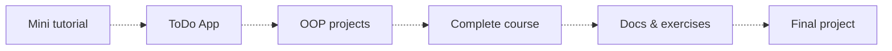

## Half hour per day

### Typescript learning path plan



### Activity

| Date | Worked on... | Time spent |
| :---: | --- | :---: |
| 02.11.2023. 03.11.2023. | Setting up the repository and creating a work plan for the following period.  | 1h |
| 06.11.2023. 10.11.2023. | Project setup, compiling typescript, type aliases, objects and arrays from the Net Ninja course.  | 2h |
| 13.11.2023. 17.11.2023. | Interfaces with classes from the Net Ninja course.  | 1h |
| 20.11.2023. 24.11.2023. | DOM manipulation form Net Ninja course.  | 1.5h |
| 27.11.2023. 01.12.2023. | Rendering an HTML template from the Net Ninja course.  | 1.5h |
| 04.12.2023. 08.12.2023. | Creating a class which is used for rendering HTML.  | 2h |
| 08.12.2023. 31.12.2023. | Finishing mini tutorial  | 6h |
| 01.01.2024. 31.01.2024. | Pause  | -- |
| 01.02.2024. 15.02.2024. | Todo applicaton  | 5h |
| 15.02.2024. 2024. | OOP Projects  |  |


### Content

Mini tutorial - [Net Ninja TypeScript Tutorial](https://www.youtube.com/playlist?list=PL4cUxeGkcC9gUgr39Q_yD6v-bSyMwKPUI) <br />
Complete course - [FCC TypeScript Course](https://www.youtube.com/watch?v=30LWjhZzg50) <br />
Docs - [Official TypeScript Docs](https://www.typescriptlang.org/docs/handbook/typescript-from-scratch.html) <br />
OOP Projects - [OOP Project 01](https://github.com/milanpanin/half_hour_per_day/blob/master/oop-task-1/README.md) <br />

### Project setup

TypeScript global installation:
```sh
npm install -g typescript
```

Initialization of the tsconfig.json file:
```sh
tsc --init
```

Compile the specified TypeScript file with watch mode:
```sh
tsc fileName.ts -w
```
