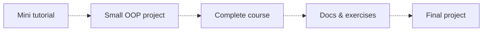

## Half hour per day

### Typescript learning path plan

### Activity

| Date | Worked on... | Time spent |
| :---: | --- | :---: |
| 02.11.2023. 03.11.2023. | Setting up the repository and creating a work plan for the following period.  | 1h |
| 06.11.2023. 10.11.2023. | | 2h |
| 13.11.2023. 17.11.2023. | | |
| 20.11.2023. 24.11.2023. | | |
| 27.11.2023. 01.12.2023. | | |

### Content

Mini tutorial - [Net Ninja TypeScript Tutorial](https://www.youtube.com/playlist?list=PL4cUxeGkcC9gUgr39Q_yD6v-bSyMwKPUI)  
Complete course - [FCC TypeScript Course](https://www.youtube.com/watch?v=30LWjhZzg50)  
Docs - [Official TypeScript Docs](https://www.typescriptlang.org/docs/handbook/typescript-from-scratch.html)  
